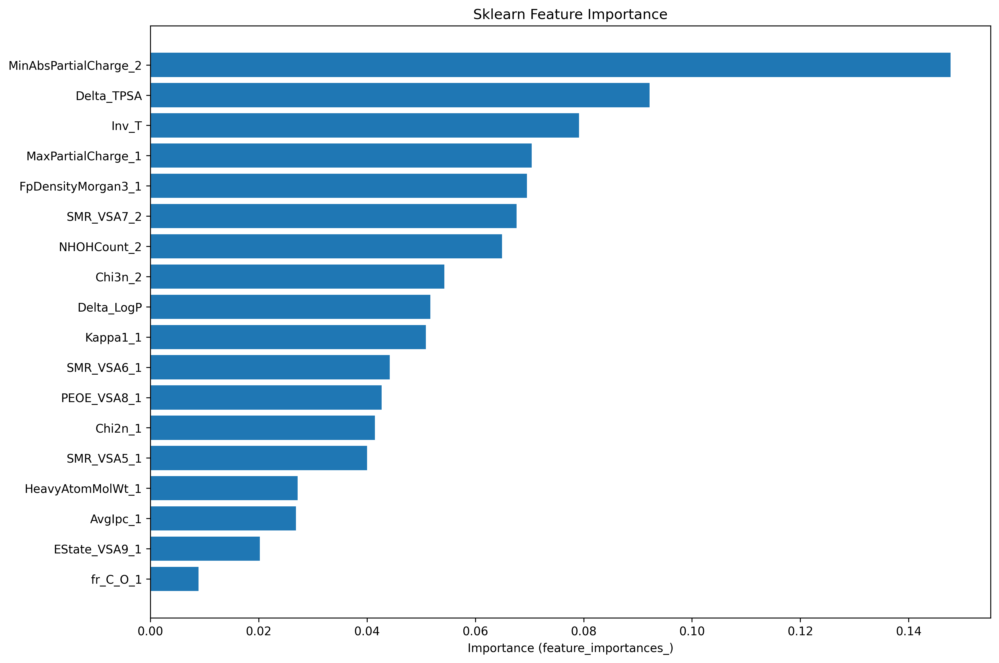
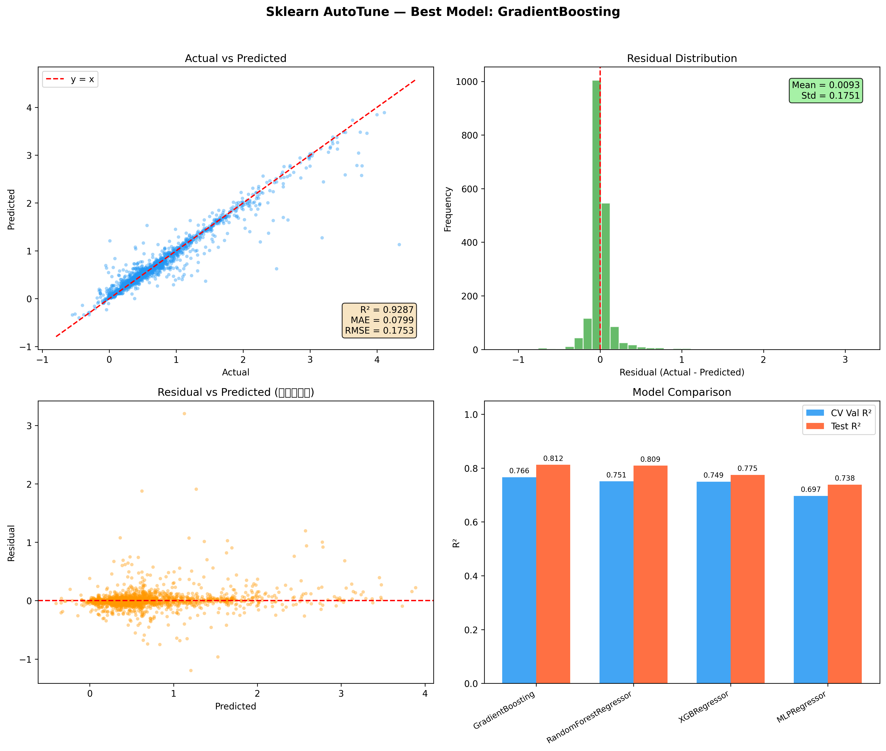
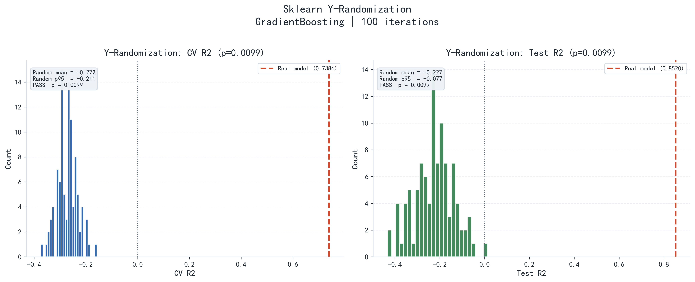
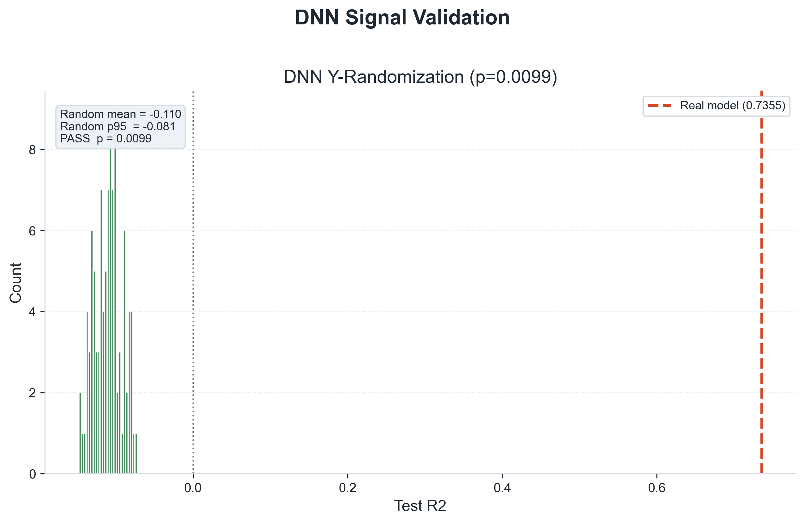
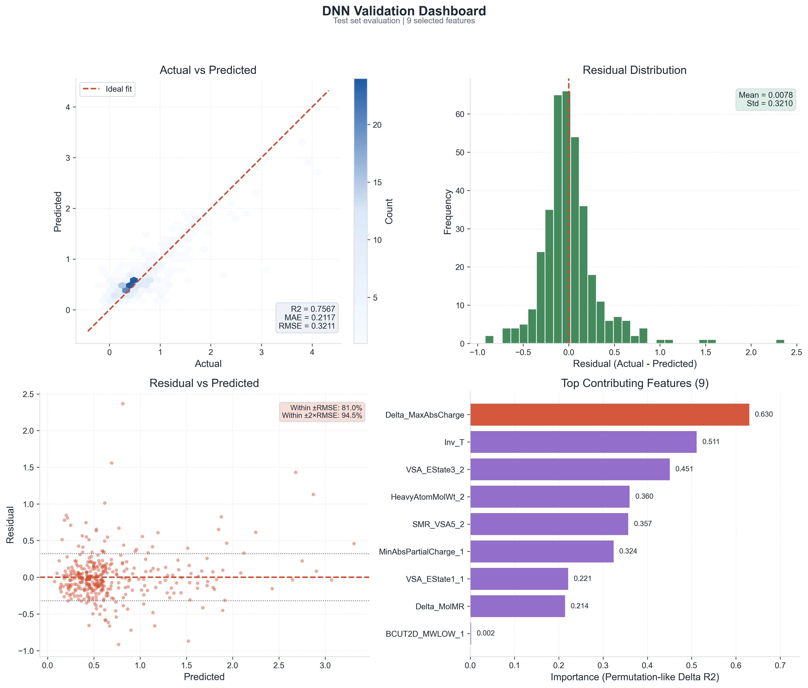

<p align="center">
  <a href="README.md">简体中文</a> ·
  <a href="docs/README_EN.md">English</a> ·
  <a href="docs/README_JA.md">日本語</a>
</p>

# 基于分子描述符的哈金斯参数（Huggins Parameter）QSAR 预测模型

> 本项目通过 **QSAR（定量构效关系）** 方法，利用分子描述符和机器学习 / 深度学习模型预测聚合物-溶剂体系的 **Huggins 参数（χ）**。

---

## 📋 目录

- [项目简介](#项目简介)
- [项目结构](#项目结构)
- [全流程概览（Step 1-6）](#全流程概览step-1-6)
- [建模阶段（Step 5）](#建模阶段step-5)
- [验证与分析阶段（Step 6）](#验证与分析阶段step-6)
- [数据文件说明](#数据文件说明)
- [模型性能基准](#模型性能基准)
- [实验存档](#实验存档)
- [代表性输出图](#代表性输出图)
- [快速开始](#快速开始)
- [评估指标](#评估指标)

---

## 项目简介

**Huggins 参数（χ）** 是描述聚合物-溶剂相互作用的关键热力学参数，其值反映了混合体系中溶剂与聚合物之间的亲和性。

本项目的核心思路是：

1. 从原始文献数据中提取化合物名称，转换为 **SMILES** 分子结构表示
2. 合并多来源数据集（旧数据 323 条 + 新数据 1586 条，清洗并解决文献间 chi 冲突后得到 **1815 条**）
3. 利用 **RDKit** 自动计算全部 **~210 个** 2D 分子描述符 + 指纹相似度 + 交互特征，生成 **332 维特征矩阵**
4. 使用 **遗传算法（GA）** 从 332 维中选出最优特征子集
5. 基于最优特征，使用 **AutoTune** 自动超参数优化训练 ML / DNN 模型

---

## 项目结构

```
Graduation-project/
│
├── 获取SMILES.py              # Step 1: 化合物名称 → SMILES
├── 数据处理部分代码.py          # Step 2: χ 表达式解析 + 温度裂变
├── 合并数据集.py               # Step 2.5: 合并旧数据与新数据
├── 特征工程.py                 # Step 3: 全量 RDKit 描述符提取 (332 维)
├── 遗传.py                    # Step 4a: 遗传算法 (GA) 粗筛（性能版，RF evaluator）
├── 遗传_ElasticNet.py         # Step 4a: 遗传算法 (GA) 粗筛（物理版，ElasticNet evaluator）
├── 特征筛选.py                 # Step 4b: RFECV 精筛
├── feature_config.py           # 特征配置中心 (统一管理选中的特征列)
│
├── DNN_AutoTune.py            # Step 5a: DNN Hyperband 自动调参
├── Sklearn_AutoTune.py        # Step 5b: Sklearn 随机搜索自动调参
│
├── DNN_模型验证.py             # Step 6a: DNN 模型验证
├── DNN特征贡献分析.py          # Step 6c: DNN SHAP 特征贡献分析
├── Y_Randomization.py         # Step 6d: Sklearn Y-Randomization 验证
├── DNN_Y_Randomization.py     # Step 6e: DNN Y-Randomization 验证
│
├── data/                      # 中间过程数据
│   ├── smiles_raw.csv
│   ├── smiles_cleaned.xlsx
│   ├── huggins_preprocessed.xlsx
│   ├── 43579_2022_237_MOESM1_ESM.csv  # 新增外部数据集 (1586 条)
│   ├── merged_dataset.csv             # 合并后数据集 (1815 条，冲突已解决)
│   ├── molecular_features.xlsx        # 332 维特征矩阵
│   └── features_optimized.xlsx        # 筛选后特征子集
│
├── results/                   # 模型与结果
│   ├── best_model.keras        # DNN AutoTune 最优模型
│   ├── best_model_preprocess.pkl # DNN 预处理器 + 最优超参
│   ├── sklearn_model_bundle.pkl # Sklearn 统一模型包
│   ├── ga_best_model.pkl      # GA 选出的最优模型
│   ├── ga_selected_features.txt     # GA 选中的特征列表
│   ├── ga_evolution_log.csv         # GA 进化日志
│   ├── sklearn_tuning_summary.csv   # AutoTune 寻优报告
│   ├── train_test_split_indices.npz # 统一 train/test 划分索引
│   └── feature_selection.png        # 特征筛选可视化
│
├── final_results/             # 最终交付结果（与中间体分离）
│   ├── dnn/                   # Git 仅跟踪 .png/.csv；其余本地生成
│   │   ├── dnn_validation_plots.png
│   │   ├── dnn_validation_results.csv
│   │   ├── dnn_feature_importance.csv
│   │   └── dnn_y_randomization.png
│   └── sklearn/               # Git 仅跟踪 .png；其余本地生成
│       ├── sklearn_feature_importance.png
│       ├── sklearn_validation_plots.png
│       └── y_randomization.png
│
├── utils/                     # 共享工具模块
│   ├── data_utils.py           # load_saved_split_indices 等
│   └── plot_style.py           # 统一绘图主题
│
├── requirements.txt           # Python 依赖清单
├── README.md                  # 本文件
│
├── 模型/                      # 历史模型存档
└── 废弃文件存档/               # 已归档的废弃文件 (Sklearn.py, DNN.py 等)
```

---

## 全流程概览（Step 1-6）

| 阶段 | 主要脚本 | 主要输出 |
|------|----------|----------|
| Step 1：SMILES 获取 | `获取SMILES.py` | `data/smiles_raw.csv` |
| Step 2：数据预处理 | `数据处理部分代码.py`、`合并数据集.py` | `data/huggins_preprocessed.xlsx`、`data/merged_dataset.csv` |
| Step 3：特征工程 | `特征工程.py` | `data/molecular_features.xlsx`（332 维） |
| Step 4：特征筛选 | `遗传.py`（性能版 GA）、`遗传_ElasticNet.py`（物理版 GA）、`特征筛选.py` | `results/ga_selected_features.txt`、`data/features_optimized.xlsx` |
| Step 5：模型训练与调参 | `Sklearn_AutoTune.py`、`DNN_AutoTune.py` | `final_results/sklearn/*`、`results/best_model.keras` |
| Step 6：模型验证与分析 | `Y_Randomization.py`、`DNN_Y_Randomization.py`、`DNN特征贡献分析.py` | `final_results/sklearn/y_randomization.*`、`final_results/dnn/dnn_y_randomization.*` |

---

## 建模阶段（Step 5）

### Step 5a：DNN Hyperband 自动调参

**脚本**: [`DNN_AutoTune.py`](DNN_AutoTune.py)

使用 Keras Tuner 的 Hyperband 算法搜索 DNN 最优架构（1-3 层、12-64 节点、学习率、正则化等）。

| 配置项 | 值 |
|--------|------|
| 搜索策略 | Hyperband (Keras Tuner) |
| 搜索空间 | 1-3 层, 12-64 节点, L2 正则化, Dropout |
| 数据划分 | 60% 训练 / 20% 验证 / 20% 测试 |
| 标准化 | X 和 y 均使用 StandardScaler |
| 重训 | 最优架构多种子重训 8 次 |

```bash
# 需要使用 .venv 中的 Python (Keras 3 兼容)
.venv\Scripts\python.exe DNN_AutoTune.py
```

### Step 5b：Sklearn AutoTune（推荐）

**脚本**: [`Sklearn_AutoTune.py`](Sklearn_AutoTune.py)

4 个模型 × 50 组参数 × 5 折交叉验证自动寻优：

| 模型 | 搜索维度 |
|------|---------|
| GradientBoosting | loss, lr, n_estimators, depth, subsample |
| XGBRegressor | lr, n_estimators, depth, reg_alpha/lambda |
| RandomForest | n_estimators, depth, max_features |
| MLPRegressor | hidden layers, activation, alpha, lr |

运行后会自动完成：

1. 最优模型搜索（CV 选模）
2. 测试集验证（R²/MAE/RMSE，仅用未参与训练的测试集）
3. 特征贡献分析（内置重要性或 permutation importance）
4. 验证可视化（Actual vs Predicted、残差分布、模型对比等 4 张图）
5. 将最终交付文件输出到 `final_results/sklearn/`

```bash
python Sklearn_AutoTune.py
```

---

## 验证与分析阶段（Step 6）

### 模型验证

| 脚本 | 功能 |
|------|------|
| [`DNN_模型验证.py`](DNN_模型验证.py) | 加载 DNN 模型，在测试集上评估 R²/MAE/RMSE |
| [`Sklearn_AutoTune.py`](Sklearn_AutoTune.py) | 训练结束后自动输出 Sklearn 验证结果（`final_results/sklearn/sklearn_validation_results.xlsx`） |

### 特征贡献分析

| 脚本 | 功能 |
|------|------|
| [`DNN特征贡献分析.py`](DNN特征贡献分析.py) | SHAP GradientExplainer 分析 DNN 特征贡献 |
| [`Sklearn_AutoTune.py`](Sklearn_AutoTune.py) | 训练结束后自动输出 Sklearn 特征贡献（`final_results/sklearn/sklearn_feature_importance.*`） |

### Y-Randomization 验证

**脚本**: [`Y_Randomization.py`](Y_Randomization.py)

**功能**: Y-Scrambling 验证，通过 100 次随机打乱 y 值并重训模型，验证 QSAR 模型是否真正学到了特征与目标值的关系。如果真实模型 R² 远高于随机模型分布 (p < 0.05)，则模型有效。

**输出**: `final_results/sklearn/y_randomization.png`、`y_randomization.csv`

```bash
python Y_Randomization.py
```

### DNN Y-Randomization 验证

**脚本**: [`DNN_Y_Randomization.py`](DNN_Y_Randomization.py)

**功能**: 在复用同一 train/test 划分的前提下，对 DNN 的 `y_train/y_val` 进行随机打乱并重复重训，对比真实 DNN 与随机化 DNN 的测试集 R² 分布与 p-value。

**输出**: `final_results/dnn/dnn_y_randomization.csv`、`dnn_y_randomization.png`、`dnn_y_randomization_summary.txt`

```bash
python DNN_Y_Randomization.py
```

### DNN 综合验证与特征贡献分析（最新 AutoTune 版本）

**脚本**: [`DNN特征贡献分析.py`](DNN特征贡献分析.py)

**功能**: 严格使用 `best_model.keras + best_model_preprocess.pkl` 进行 DNN 综合分析，输出与 sklearn 类似的 2×2 验证图（Actual vs Predicted、残差分布、残差-预测散点、特征贡献），并导出验证明细与特征重要性表。

**输出**: `final_results/dnn/dnn_validation_plots.png`、`dnn_validation_results.csv`、`dnn_feature_importance.csv`

```bash
python DNN特征贡献分析.py
```

> `Sklearn_模型验证.py` 与 `RF特征贡献分析.py` 已归档至 `废弃文件存档/`，用于历史兼容与排错。

---

## 数据文件说明

| 文件 | 位置 | 描述 | 产生阶段 | Git |
|------|------|------|----------|-----|
| `43579_2022_237_MOESM1_ESM.csv` | `data/` | 外部数据集 (1586 条) | 新增输入 | ✅ |
| `smiles_raw.csv` | `data/` | SMILES 查询结果 | Step 1 | ✅ |
| `smiles_cleaned.xlsx` | `data/` | 手动清洗后的 SMILES | 手动处理 | ✅ |
| `huggins_preprocessed.xlsx` | `data/` | 预处理数据 (323 条) | Step 2 | ✅ |
| `merged_dataset.csv` | `data/` | 合并数据集 (1815 条，冲突已解决) | Step 2.5 | ✅ |
| `molecular_features.xlsx` | `data/` | 332 维特征矩阵 | Step 3 | ✅ |
| `features_optimized.xlsx` | `data/` | 筛选后特征子集 | Step 4 | ✅ |
| `ga_selected_features.txt` | `results/` | GA 选中的特征列表 | Step 4 | — |
| `ga_evolution_log.csv` | `results/` | GA 进化日志 | Step 4 | — |
| `train_test_split_indices.npz` | `results/` | 统一 train/test 划分索引 | Step 4 | — |
| `sklearn_model_bundle.pkl` | `results/` | Sklearn 统一模型包 | Step 5 | — |
| `best_model.keras` | `results/` | DNN AutoTune 最优模型 | Step 5 | — |
| `sklearn_feature_importance.png` | `final_results/sklearn/` | Sklearn 特征贡献图 | Step 5 | ✅ |
| `sklearn_validation_plots.png` | `final_results/sklearn/` | Sklearn 验证可视化 (4 子图) | Step 5 | ✅ |
| `y_randomization.png` | `final_results/sklearn/` | Y-Randomization R² 分布图 | Step 6 | ✅ |
| `dnn_validation_plots.png` | `final_results/dnn/` | DNN 综合验证图 (4 子图) | Step 6 | ✅ |
| `dnn_validation_results.csv` | `final_results/dnn/` | DNN 测试集预测与残差明细 | Step 6 | ✅ |
| `dnn_feature_importance.csv` | `final_results/dnn/` | DNN 特征贡献（SHAP/回退重要性） | Step 6 | ✅ |
| `dnn_y_randomization.png` | `final_results/dnn/` | DNN Y-Randomization R² 分布图 | Step 6 | ✅ |

> ℹ️ `results/` 默认不纳入 Git 跟踪，仅保留 `.gitkeep` 和历史兼容图 `dnn_shap_analysis.png`。`final_results/` 下仅 `.png` / `.csv` 被 Git 跟踪，其余（如 `.pkl`、`.txt`、`.xlsx`）为本地产物。

---

## 模型性能基准

> 以下为当前工作区主线结果（`pre_physics`）：1815 样本，最终 9 特征（统一 train/test 划分）

| 模型 | CV Val R² | Test R² | Test MAE | Test RMSE |
|------|----------|---------|---------|---------|
| **GradientBoosting** | **0.739** | **0.852** | **0.145** | **0.250** |
| XGBRegressor | 0.725 | 0.827 | 0.165 | 0.271 |
| RandomForestRegressor | 0.699 | 0.822 | 0.162 | 0.275 |
| MLPRegressor | 0.597 | 0.748 | 0.227 | 0.327 |
| DNN (AutoTune, best run) | — | 0.764 | 0.208 | 0.316 |

> ℹ️ 所有模型均在相同的测试集上评估，测试集不参与特征选择或模型训练。
> ℹ️ DNN 行为 AutoTune 最优架构 8 次重训中的最佳一次（非交叉验证均值）。
> ℹ️ 当前默认展示的是 9 特征 `pre_physics` 可解释基线；其余 5 组对比实验已单独归档。

---

## 实验存档

- 六组结果与代码快照：[`实验存档/20260302_six_way_snapshots/README.md`](实验存档/20260302_six_way_snapshots/README.md)
- 特征选择探索日志：[`实验存档/EXPLORATION_LOG.md`](实验存档/EXPLORATION_LOG.md)

---

## 代表性输出图

### Sklearn：特征贡献图



### Sklearn：验证可视化（4 子图）



### Sklearn：Y-Randomization 分布图



### DNN：Y-Randomization 分布图



### DNN：综合验证图（4 子图）



---

## 快速开始

```bash
# 1. 克隆项目
git clone https://github.com/Nothingness-Void/Graduation-project
cd Graduation-project

# 2. 安装依赖
pip install -r requirements.txt
conda install -c conda-forge rdkit

# 3. 数据合并 + 特征工程 + 两阶段特征选择 + 建模
python 合并数据集.py              # 合并旧数据与新数据
python 特征工程.py                # 全量 RDKit 描述符 (332 维)
python 遗传_ElasticNet.py        # 物理版 GA 粗筛 (332→~20 特征, ElasticNet, 约 10-20 min) [推荐]
# python 遗传.py                 # 性能版 GA 粗筛 (332→~30 特征, RF, 约 20-40 min) [备选]
python 特征筛选.py                # RFECV 精筛 (23 → 9, 最终特征集)
python Sklearn_AutoTune.py       # Sklearn 自动调参
python DNN_AutoTune.py           # DNN Hyperband 自动调参
python Y_Randomization.py        # Sklearn Y-Randomization 验证（可选）
python DNN_Y_Randomization.py    # DNN Y-Randomization 验证（可选）

# 或: 如果已有 data/molecular_features.xlsx, 从 Step 4 开始
python 遗传_ElasticNet.py        # GA 粗筛
python 特征筛选.py                # RFECV 精筛 (→ 9 特征)
python Sklearn_AutoTune.py
python DNN_AutoTune.py
```

---

## 评估指标

| 指标 | 公式 | 说明 |
|------|------|------|
| **R²** | 1 - SS_res/SS_tot | 决定系数，越接近 1 越好 |
| **MAE** | mean(\|y_true - y_pred\|) | 平均绝对误差 |
| **RMSE** | √(mean((y_true - y_pred)²)) | 均方根误差 |

---

## License

本项目为毕业设计项目，仅供学术研究使用。
