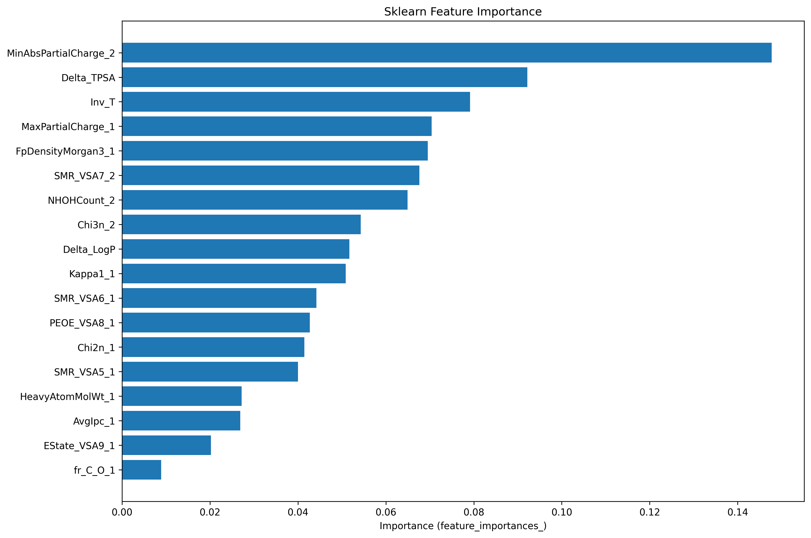
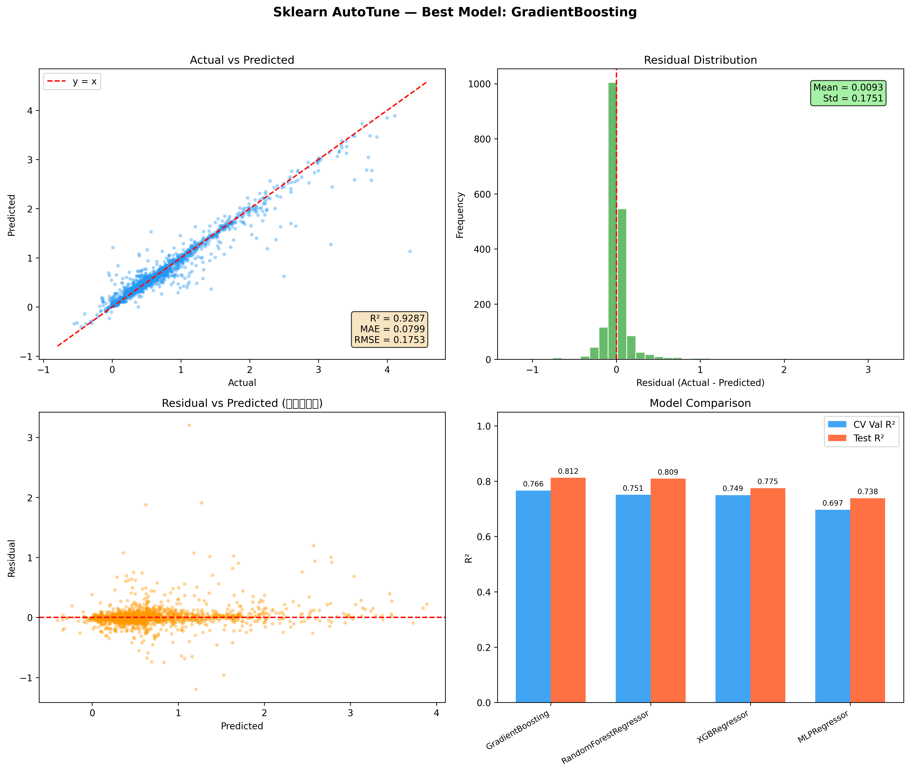
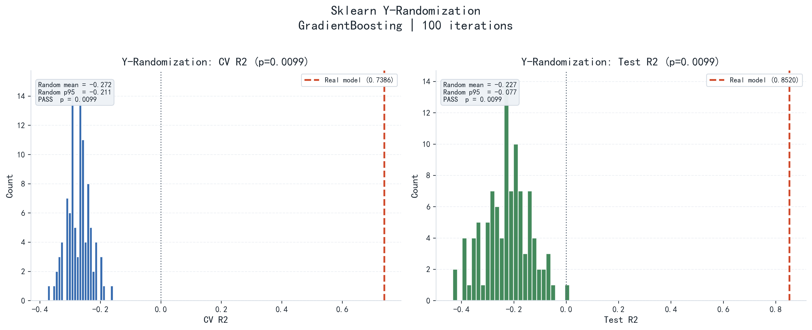
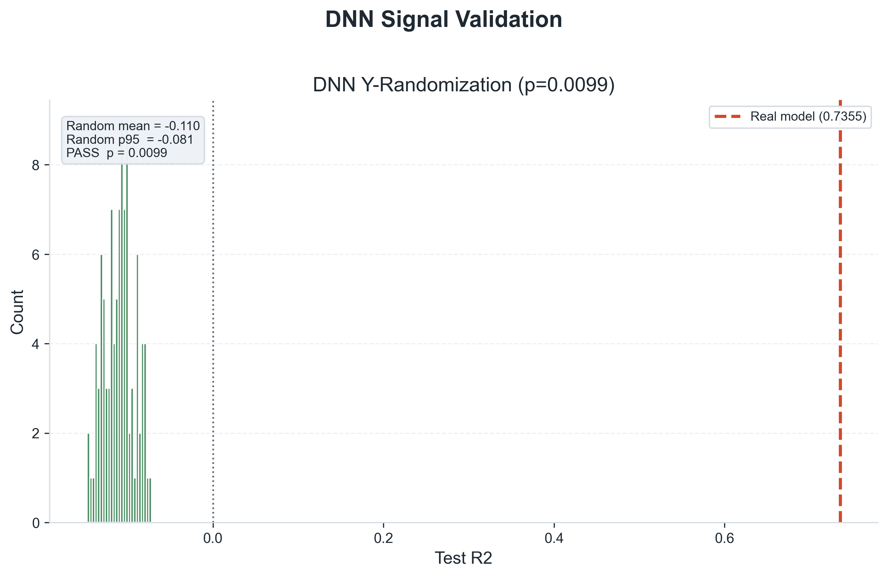
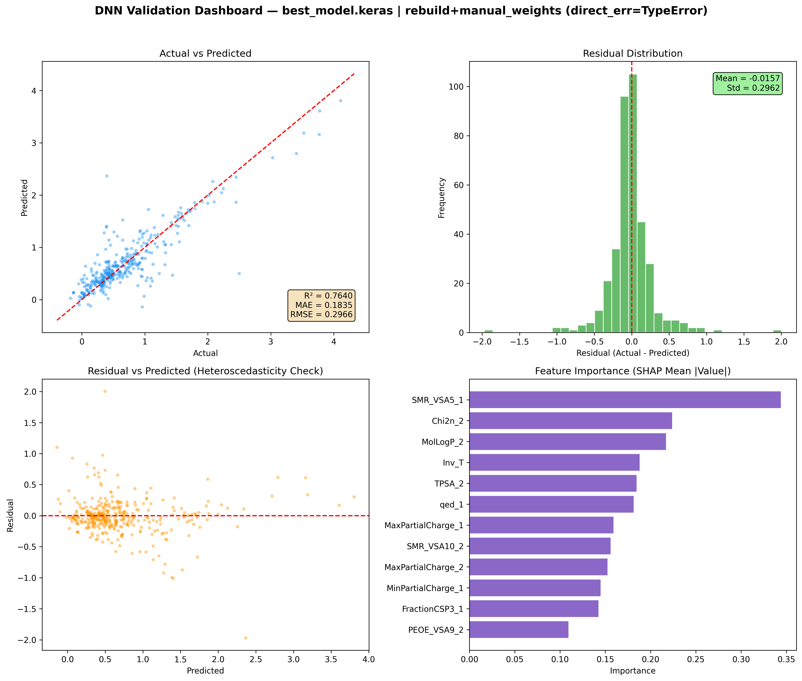

<p align="center">
  <a href="../README.md">简体中文</a> ·
  <a href="README_EN.md">English</a> ·
  <a href="README_JA.md">日本語</a>
</p>

# Huggins Parameter (chi) QSAR Prediction Model based on Molecular Descriptors

> This version is AI-translated and may contain minor wording errors.
>
> This project uses **QSAR (Quantitative Structure-Activity Relationship)** methods to predict the **Huggins Parameter (chi)** of polymer-solvent systems using molecular descriptors and machine learning / deep learning models.

---

## 📋 Table of Contents

- [Project Overview](#project-overview)
- [Project Structure](#project-structure)
- [Full Pipeline Overview (Step 1-6)](#full-pipeline-overview-step-1-6)
- [Modeling Phase (Step 5)](#modeling-phase-step-5)
- [Validation & Analysis Phase (Step 6)](#validation--analysis-phase-step-6)
- [Data File Descriptions](#data-file-descriptions)
- [Model Performance Benchmarks](#model-performance-benchmarks)
- [Representative Output Figures](#representative-output-figures)
- [Quick Start](#quick-start)
- [Evaluation Metrics](#evaluation-metrics)

---

## Project Overview

The **Huggins Parameter (chi)** is a key thermodynamic parameter describing polymer-solvent interactions, reflecting the affinity between a solvent and a polymer in a mixture.

The core workflow of this project is:

1. Extract compound names from original literature data and convert them to **SMILES** molecular structure representations.
2. Merge datasets from multiple sources (323 legacy records + 1586 new records = **1815 records** after resolving cross-literature chi conflicts via median aggregation).
3. Use **RDKit** to automatically calculate all **~210** 2D molecular descriptors + fingerprint similarities + interaction features, generating a **332-dimensional feature matrix**.
4. Use **Genetic Algorithm (GA)** to select the optimal feature subset from the 332 dimensions.
5. Based on the optimal features, use **AutoTune** for automatic hyperparameter optimization to train ML / DNN models.

---

## Project Structure

```
Graduation-project/
│
├── 获取SMILES.py              # Step 1: Compound Name → SMILES
├── 数据处理部分代码.py          # Step 2: χ Expression Parsing + Temperature Expansion
├── 合并数据集.py               # Step 2.5: Merge Legacy & New Datasets (with SMILES cleanup & chi conflict resolution)
├── 特征工程.py                 # Step 3: Full RDKit Descriptor Extraction (332-dim)
├── 遗传.py                    # Step 4a: Genetic Algorithm (GA) Coarse Selection
├── 特征筛选.py                 # Step 4b: RFECV Refinement
├── feature_config.py           # Feature Config Center (Unified Management of Selected Features)
│
├── DNN_AutoTune.py            # Step 5a: DNN Hyperband Auto-Tuning
├── Sklearn_AutoTune.py        # Step 5b: Sklearn RandomizedSearch Auto-Tuning
│
├── DNN_模型验证.py             # Step 6a: DNN Model Validation
├── DNN特征贡献分析.py          # Step 6c: DNN SHAP Feature Contribution Analysis
├── Y_Randomization.py         # Step 6d: Sklearn Y-Randomization Validation
├── DNN_Y_Randomization.py     # Step 6e: DNN Y-Randomization Validation
│
├── Huggins.xlsx               # Raw Data: Compound Names + Huggins Parameters
│
├── data/                      # Intermediate Data
│   ├── smiles_raw.csv
│   ├── smiles_cleaned.xlsx
│   ├── huggins_preprocessed.xlsx
│   ├── 43579_2022_237_MOESM1_ESM.csv  # New External Dataset (1586 records)
│   ├── merged_dataset.csv             # Merged Dataset (1815 records, conflicts resolved)
│   ├── molecular_features.xlsx        # 332-dim Feature Matrix
│   └── features_optimized.xlsx        # Filtered Feature Subset
│
├── results/                   # Models & Results
│   ├── best_model.keras        # DNN AutoTune Best Model
│   ├── best_model_preprocess.pkl # DNN Preprocessor + Best Hyperparameters
│   ├── sklearn_model_bundle.pkl # Sklearn Unified Model Bundle
│   ├── ga_best_model.pkl      # GA Best Model
│   ├── ga_selected_features.txt     # GA Selected Feature List
│   ├── ga_evolution_log.csv         # GA Evolution Log
│   ├── sklearn_tuning_summary.csv   # AutoTune Optimization Report
│   ├── train_test_split_indices.npz # Unified Train/Test Split Indices
│   ├── feature_selection.png        # Feature Selection Visualization
│   └── dnn_loss.png                 # Training Loss Curve
│
├── final_results/             # Final Deliverables (Separated from Intermediates)
│   ├── dnn/
│   │   ├── dnn_y_randomization.csv
│   │   ├── dnn_y_randomization.png
│   │   ├── dnn_y_randomization_summary.txt
│   │   ├── dnn_validation_plots.png
│   │   ├── dnn_validation_results.csv
│   │   └── dnn_feature_importance.csv
│   └── sklearn/
│       ├── sklearn_model_bundle.pkl
│       ├── fingerprint_model.pkl
│       ├── sklearn_tuning_summary.csv
│       ├── sklearn_validation_results.xlsx
│       ├── sklearn_feature_importance.csv
│       ├── sklearn_feature_importance.png
│       ├── sklearn_validation_plots.png
│       ├── y_randomization.png
│       ├── y_randomization.csv
│       └── sklearn_final_report.txt
│
├── utils/                     # Shared Utility Modules
│   └── data_utils.py           # load_saved_split_indices, etc.
│
├── requirements.txt           # Python Dependency List
├── README.md                  # This file
│
├── 测试/                      # Experimental Scripts
├── 模型/                      # Historical Model Archives
├── 参考/                      # Reference Code
└── 废弃文件存档/               # Archived Obsolete Files (Sklearn.py, DNN.py, etc.)
```

---

## Full Pipeline Overview (Step 1-6)

| Phase | Main Scripts | Main Outputs |
|-------|-------------|--------------|
| Step 1: SMILES Retrieval | `获取SMILES.py` | `data/smiles_raw.csv` |
| Step 2: Data Preprocessing | `数据处理部分代码.py`, `合并数据集.py` | `data/huggins_preprocessed.xlsx`, `data/merged_dataset.csv` |
| Step 3: Feature Engineering | `特征工程.py` | `data/molecular_features.xlsx` (332-dim) |
| Step 4: Feature Selection | `遗传.py`, `特征筛选.py` | `results/ga_selected_features.txt`, `data/features_optimized.xlsx` |
| Step 5: Model Training & Tuning | `Sklearn_AutoTune.py`, `DNN_AutoTune.py` | `final_results/sklearn/*`, `results/best_model.keras` |
| Step 6: Validation & Analysis | `Y_Randomization.py`, `DNN_Y_Randomization.py`, `DNN特征贡献分析.py` | `final_results/sklearn/y_randomization.*`, `final_results/dnn/dnn_y_randomization.*` |

---

## Modeling Phase (Step 5)

### Step 5a: DNN Hyperband Auto-Tuning

**Script**: [`DNN_AutoTune.py`](DNN_AutoTune.py)

Uses Keras Tuner's Hyperband algorithm to search for the optimal DNN architecture (1-3 layers, 12-64 nodes, learning rate, regularization, etc.).

| Configuration Item | Value |
|--------------------|-------|
| Search Strategy | Hyperband (Keras Tuner) |
| Search Space | 1-3 layers, 12-64 nodes, L2 Regularization, Dropout |
| Data Split | 60% Train / 20% Validation / 20% Test |
| Standardization | StandardScaler for both X and y |
| Retraining | Best architecture retrained 8 times with different seeds |

```bash
# Requires Python in .venv (Keras 3 compatible)
.venv\Scripts\python.exe DNN_AutoTune.py
```

### Step 5b: Sklearn AutoTune (Recommended)

**Script**: [`Sklearn_AutoTune.py`](Sklearn_AutoTune.py)

4 Models × 50 Parameter Sets × 5-Fold Cross-Validation Automatic Optimization:

| Model | Search Dimensions |
|-------|------------------|
| GradientBoosting | loss, lr, n_estimators, depth, subsample |
| XGBRegressor | lr, n_estimators, depth, reg_alpha/lambda |
| RandomForest | n_estimators, depth, max_features |
| MLPRegressor | hidden layers, activation, alpha, lr |

Automatically performs the following after running:

1. Optimal Model Search (CV Selection)
2. Test Set Validation (R²/MAE/RMSE, using only the test set not involved in training)
3. Feature Contribution Analysis (Built-in importance or permutation importance)
4. Validation Visualization (Actual vs Predicted, Residual Distribution, Model Comparison, etc. - 4 plots)
5. Output final deliverables to `final_results/sklearn/`

```bash
python Sklearn_AutoTune.py
```

---

## Validation & Analysis Phase (Step 6)

### Model Validation

| Script | Function |
|--------|----------|
| [`DNN_模型验证.py`](DNN_模型验证.py) | Loads DNN model, evaluates R²/MAE/RMSE on full dataset |
| [`Sklearn_AutoTune.py`](Sklearn_AutoTune.py) | Automatically outputs Sklearn validation results after training (`final_results/sklearn/sklearn_validation_results.xlsx`) |

### Feature Contribution Analysis

| Script | Function |
|--------|----------|
| [`DNN特征贡献分析.py`](DNN特征贡献分析.py) | SHAP GradientExplainer analysis of DNN feature contributions |
| [`Sklearn_AutoTune.py`](Sklearn_AutoTune.py) | Automatically outputs Sklearn feature contributions after training (`final_results/sklearn/sklearn_feature_importance.*`) |

### Y-Randomization Validation

**Script**: [`Y_Randomization.py`](Y_Randomization.py)

**Function**: Y-Scrambling validation. Randomly shuffles y-values 100 times and retrains the model to verify if the QSAR model has truly learned the relationship between features and the target. If the real model R² is significantly higher than the randomized model distribution (p < 0.05), the model is valid.

**Output**: `final_results/sklearn/y_randomization.png`, `y_randomization.csv`

```bash
python Y_Randomization.py
```

### DNN Y-Randomization Validation

**Script**: [`DNN_Y_Randomization.py`](DNN_Y_Randomization.py)

**Function**: Reusing the same train/test split, randomly shuffles DNN's `y_train/y_val` and repeats retraining to compare the test set R² distribution and p-value of the real DNN vs. randomized DNN.

**Output**: `final_results/dnn/dnn_y_randomization.csv`, `dnn_y_randomization.png`, `dnn_y_randomization_summary.txt`

```bash
python DNN_Y_Randomization.py
```

### DNN Integrated Validation & Feature Contribution (Latest AutoTune)

**Script**: [`DNN特征贡献分析.py`](DNN特征贡献分析.py)

**Function**: Strictly uses `best_model.keras + best_model_preprocess.pkl` to generate a sklearn-style 2×2 DNN dashboard (Actual vs Predicted, Residual Distribution, Residual vs Predicted, Feature Importance), plus validation details and feature importance tables.

**Output**: `final_results/dnn/dnn_validation_plots.png`, `dnn_validation_results.csv`, `dnn_feature_importance.csv`

```bash
python DNN特征贡献分析.py
```

> `Sklearn_模型验证.py` and `RF特征贡献分析.py` have been archived to `废弃文件存档/` for historical compatibility and debugging.

---

## Data File Descriptions

| File | Location | Description | Generated Stage |
|------|----------|-------------|-----------------|
| `Huggins.xlsx` | Root | Raw Data | Input |
| `43579_2022_237_MOESM1_ESM.csv` | `data/` | External Dataset (1586 records) | New Input |
| `smiles_raw.csv` | `data/` | SMILES Query Results | Step 1 |
| `smiles_cleaned.xlsx` | `data/` | Manually Cleaned SMILES | Manual |
| `huggins_preprocessed.xlsx` | `data/` | Preprocessed Data (323 records) | Step 2 |
| `merged_dataset.csv` | `data/` | Merged Dataset (1815 records, conflicts resolved) | Step 2.5 |
| `molecular_features.xlsx` | `data/` | 332-dim Feature Matrix | Step 3 |
| `features_optimized.xlsx` | `data/` | Filtered Feature Subset | Step 4 |
| `ga_selected_features.txt` | `results/` | GA Selected Feature List | Step 4b |
| `ga_evolution_log.csv` | `results/` | GA Evolution Log | Step 4b |
| `sklearn_model_bundle.pkl` | `results/` | Sklearn Unified Model Bundle | Step 5 |
| `best_model.keras` | `results/` | DNN AutoTune Best Model | Step 5 |
| `train_test_split_indices.npz` | `results/` | Unified Train/Test Split Indices | Step 4a |
| `sklearn_final_report.txt` | `final_results/sklearn/` | Sklearn Final Report | Step 5d |
| `sklearn_validation_results.xlsx` | `final_results/sklearn/` | Sklearn Validation Results Detail | Step 5d |
| `sklearn_feature_importance.png` | `final_results/sklearn/` | Sklearn Feature Contribution Plot | Step 5d |
| `sklearn_validation_plots.png` | `final_results/sklearn/` | Sklearn Validation Plots (4 subplots) | Step 5d |
| `y_randomization.png` | `final_results/sklearn/` | Y-Randomization R² Distribution | Step 6 |
| `y_randomization.csv` | `final_results/sklearn/` | Y-Randomization Detailed Data | Step 6 |
| `dnn_validation_plots.png` | `final_results/dnn/` | DNN Integrated Validation Plot (4 subplots) | Step 6 |
| `dnn_validation_results.csv` | `final_results/dnn/` | DNN Test Predictions & Residuals | Step 6 |
| `dnn_feature_importance.csv` | `final_results/dnn/` | DNN Feature Contribution (SHAP/Fallback) | Step 6 |
| `dnn_y_randomization.png` | `final_results/dnn/` | DNN Y-Randomization R² Distribution | Step 6 |
| `dnn_y_randomization.csv` | `final_results/dnn/` | DNN Y-Randomization Detailed Data | Step 6 |
| `dnn_y_randomization_summary.txt` | `final_results/dnn/` | DNN Y-Randomization Summary | Step 6 |

---

## Model Performance Benchmarks

> The following are the AutoTune results on the Full Pipeline (GA → RFECV → AutoTune): **1815 samples (after data cleaning)**, final 21 features (unified train/test split)

| Model | CV Val R² | Test R² | Test MAE | Test RMSE |
|-------|-----------|---------|----------|-----------|
| **XGBRegressor** | **0.656** | **0.730** | **0.213** | **0.338** |
| GradientBoosting | 0.652 | 0.707 | 0.207 | 0.352 |
| RandomForestRegressor | 0.647 | 0.740 | 0.208 | 0.332 |
| MLPRegressor | 0.587 | 0.691 | 0.225 | 0.362 |
| DNN (AutoTune, best run) | — | 0.709 | 0.228 | 0.351 |

> ℹ️ All models are evaluated on the same test set, which is not involved in feature selection or model training.
> ℹ️ DNN row shows the best run out of 8 retrainings of the optimal architecture from AutoTune (not CV mean).
> ℹ️ Compared to the previous version, this run uses data cleaned of cross-literature chi conflicts, making evaluation more rigorous and results more reliable.

---

## Representative Output Figures

### Sklearn: Feature Importance



### Sklearn: Validation Plots (4 subplots)



### Sklearn: Y-Randomization Distribution



### DNN: Y-Randomization Distribution



### DNN: Integrated Validation Dashboard (4 subplots)



---

## Quick Start

```bash
# 1. Clone the project
git clone https://github.com/Nothingness-Void/Graduation-project
cd Graduation-project

# 2. Install dependencies
pip install -r requirements.txt
conda install -c conda-forge rdkit

# 3. Data Merge + Feature Engineering + Two-Stage Feature Selection + Modeling
python 合并数据集.py              # Merge Legacy & New Data
python 特征工程.py                # Full RDKit Descriptors (332 dim)
python 遗传.py                   # GA Coarse Selection (332 → 35, approx 20-40 min)
python 特征筛选.py                # RFECV Refinement (35 → 21)
python Sklearn_AutoTune.py       # Sklearn Auto-Tuning
python DNN_AutoTune.py           # DNN Hyperband Auto-Tuning
python Y_Randomization.py        # Sklearn Y-Randomization Validation (Optional)
python DNN_Y_Randomization.py    # DNN Y-Randomization Validation (Optional)

# OR: If data/molecular_features.xlsx already exists, start from Step 4
python 遗传.py
python Sklearn_AutoTune.py
python DNN_AutoTune.py
```

---

## Evaluation Metrics

| Metric | Formula | Description |
|--------|---------|-------------|
| **R²** | 1 - SS_res/SS_tot | Coefficient of Determination, closer to 1 is better |
| **MAE** | mean(\|y_true - y_pred\|) | Mean Absolute Error |
| **RMSE** | √(mean((y_true - y_pred)²)) | Root Mean Squared Error |

---

## License

This project is a graduation design project and is for academic research use only.
